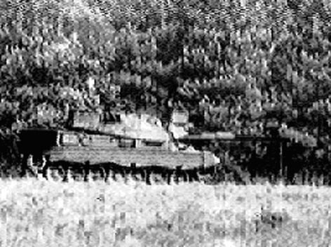
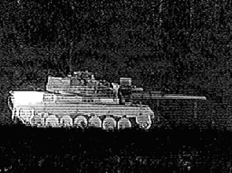
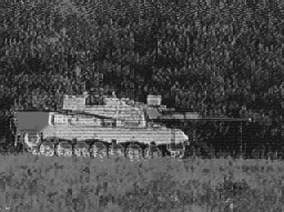
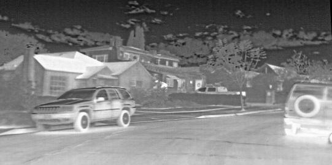
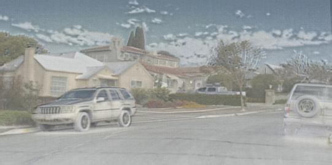
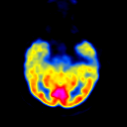
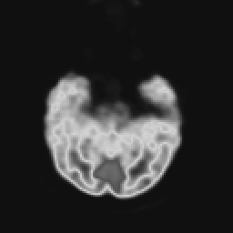
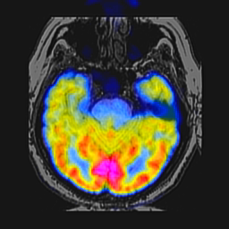
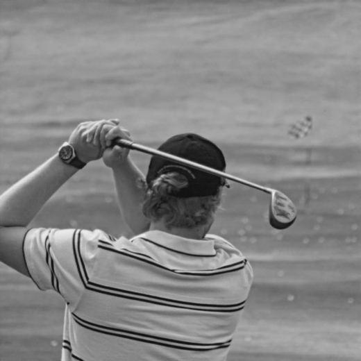

# U2Fusion-PyTorch
**U2Fusion: A Unified Unsupervised Image Fusion Network（TPAMI 2022）**
[](https://doi.org/10.1109/TPAMI.2020.3012548)
[](https://doi.org/10.1109/TPAMI.2020.3012548)
[](https://github.com/hanna-xu/U2Fusion)
---

## News

- [x] The inference code and environment configuration have been released.
- [x] The results of every task have been provided.
---
## Overview
This study proposes a novel unified and unsupervised end-to-end image fusion network, termed as U2Fusion, 
which is capable of solving different fusion problems, including multi-modal, multi-exposure, and multi-focus cases.
Now, with the upadta to the code frameworl, I will provide the version migrated to PyTorch.
The current repository supports quick testing with pretrained checkpoints.

## Tips:<br>
Large files should be downloaded separately, including the following files: <br>
#### For training:<br>
* [Training dataset ,checkpoints and vgg16.npy]( https://pan.baidu.com/s/1E7j4lHKRR4SwjcOyiUdUxQ?pwd=ra1k)<br>
---
## Visual Results

### Results on TNO

<p align="center">
   
   
  
</p>

### Results on RoadScene

<p align="center">
  
   
  
</p>

### Results on Medical

<p align="center">
   
   
  
</p>

### Results on Multi-Exposure

<p align="center">
  
  
  
</p>

### Results on Multi-Focus

<p align="center">
   
  
  
</p>

---
## Repository Structure

```text
U2Fusion-PyTorch/
├── test_imgs/
│   ├── vis-ir/
│       ├── TNO/
│           ├──vir/             # Visible Images
│           └──ir/              # Infrared Images
│       └── RoadScene/
│           ├──vir/             # Visible Images
│           └──ir/              # Infrared Images
│   ├── medical/
│       ├──mri/                 # Magnetic Resonance Images
│       └──pet/                 # Positron Emission Tomography Images
│   ├── multi-exposure/                      
│       ├── dataset1/
│           ├──ue/              # Under-Exposed Images
│           └──oe/              # Over-Exposed Images
│       └── dataset2/
│           ├──ue/              # Under-Exposed Images
│           └──oe/              # Over-Exposed Images
│   └── multi-focus/  
│        ├──far/                # Far-Focused Images    
│        └──near/               # Near-Focused Images
├── img_RGB/                    # RGB Input
├── results/                    # Inference results
├── convert_vgg.py
├── vgg16.py  
├── dataset.py
├── generator.py
├── losses.py
├── model.py
├── train.py
├── test.py                     
├── color.py                   # Its functon has been achieved in test
└── README.md
```
---


## Citation
If you find this work useful for your research, please cite our paper:
```bibtex
@article{xu2020u2fusion,
  title={U2Fusion: A Unified Unsupervised Image Fusion Network},
  author={Xu, Han and Ma, Jiayi and Jiang, Junjun and Guo, Xiaojie and Ling, Haibin},
  journal={IEEE Transactions on Pattern Analysis and Machine Intelligence},
  year={2022},
  publisher={IEEE}
}
```
